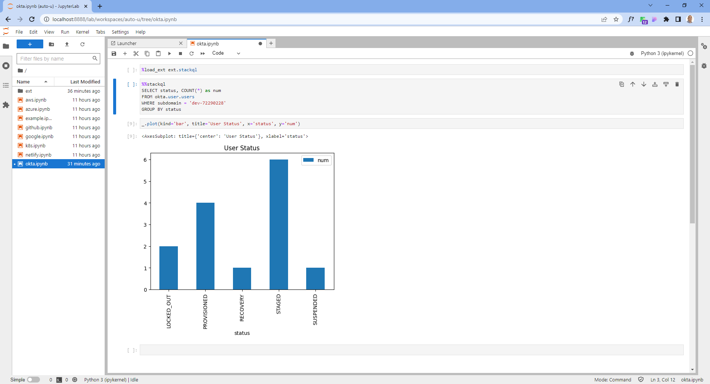

[](https://stackql.io/)  
<br />
[](https://github.com/stackql/stackql-jupyter-demo/actions/workflows/main.yml)


# StackQL Jupyter Demo

Query cloud inventory and perform analysis and visualisations using Jupyter, Python and StackQL.

## Table of contents

<!--ts-->
   * [Prerequisites](#prerequisites)
   * [Setting up authentication](#setting-up-authentication)
   * [Instructions to pull and run image from Dockerhub](#instructions-to-pull-and-run-image-from-dockerhub)
   * [Instructions to build and run locally](#instructions-to-build-and-run-locally)
<!--te-->  

<br />



## Prerequisites

- Docker
- Doocker Compose (optional)

## Setting up authentication

You will need to setup credentials for the providers required by... 
- adding the appropriate service account key(s) to the `keys/` directory 
- populating the necessary environment variables on your host machine, examples are shown here:

<details>
<summary>Setting Environment Variables (bash)</summary>
<p>

```bash
export AWS_ACCESS_KEY_ID=YOURACCESSKEYID
export AWS_SECRET_ACCESS_KEY=YOURSECRETACCESSKEY
export STACKQL_GITHUB_USERNAME=yourusername
export STACKQL_GITHUB_PASSWORD=ghp_yourtoken
export OKTA_API_TOKEN=YOUROKTAAPIKEY
export NETLIFY_AUTH_TOKEN=YOURNETLIFYTOKEN
export SUMOLOGIC_ACCESSID=YOURSUMOACCESSID
export SUMOLOGIC_ACCESSKEY=YOURSUMOACCESSKEY
export GOOGLE_CREDENTIALS=$(cat creds/my-key.json)
```
</p>
</details>

<details>
<summary>Setting Environment Variables (powershell)</summary>
<p>

```powershell
$Env:AWS_ACCESS_KEY_ID = "YOURACCESSKEYID"
$Env:AWS_SECRET_ACCESS_KEY = "YOURSECRETACCESSKEY"
$Env:STACKQL_GITHUB_USERNAME = "yourusername"
$Env:STACKQL_GITHUB_PASSWORD = "ghp_yourtoken"
$Env:OKTA_API_TOKEN = "YOUROKTAAPIKEY"
$Env:NETLIFY_AUTH_TOKEN = "YOURNETLIFYTOKEN"
$Env:SUMOLOGIC_ACCESSID = "YOURSUMOACCESSID"
$Env:SUMOLOGIC_ACCESSKEY = "YOURSUMOACCESSKEY"
$env:GOOGLE_CREDENTIALS = Get-Content -Raw -Path creds\my-key.json
```

</p>
</details>

## Instructions to pull and run image from Dockerhub

The `stackql-jupyter-demo` image is available on Dockerhub ([hub.docker.com/r/stackql/stackql-jupyter-demo](https://hub.docker.com/r/stackql/stackql-jupyter-demo)). To run it in detatched mode, execute the following command:  

> you can omit credentials for providers you don't need

using `bash`...

```bash
docker pull stackql/stackql-jupyter-demo
CID=`docker run -d -p 8888:8888 \
-e AWS_ACCESS_KEY_ID \
-e AWS_SECRET_ACCESS_KEY \
-e STACKQL_GITHUB_USERNAME \
-e STACKQL_GITHUB_PASSWORD \
-e OKTA_API_TOKEN \
-e NETLIFY_AUTH_TOKEN \
-e SUMOLOGIC_ACCESSID \
-e SUMOLOGIC_ACCESSKEY \
-e GOOGLE_CREDENTIALS \
stackql/stackql-jupyter-demo \
/bin/sh -c "/scripts/entrypoint.sh"`
# optional - copy service account keys to container
docker cp keys/stackql-security-reviewer.json  $CID:/jupyter/.keys/google-sa-key.json
```

using `powershell`...

```powershell
docker pull stackql/stackql-jupyter-demo
$CID=$(docker run -d -p 8888:8888 `
-e AWS_ACCESS_KEY_ID `
-e AWS_SECRET_ACCESS_KEY `
-e STACKQL_GITHUB_USERNAME `
-e STACKQL_GITHUB_PASSWORD `
-e OKTA_API_TOKEN `
-e NETLIFY_AUTH_TOKEN `
-e SUMOLOGIC_ACCESSID `
-e SUMOLOGIC_ACCESSKEY `
-e GOOGLE_CREDENTIALS `
stackql/stackql-jupyter-demo `
/bin/sh -c "/scripts/entrypoint.sh")
# optional - copy service account keys to container
$target=$CID + ":/jupyter/.keys/google-sa-key.json" 
docker cp keys/stackql-security-reviewer.json  $target
```

To stop and remove the container when you're finished, run...   

```bash
docker stop $(docker ps -l -q --filter status=running --filter ancestor=stackql/stackql-jupyter-demo)
docker rm $(docker ps --filter status=exited --filter ancestor=stackql/stackql-jupyter-demo -q)
```

## Instructions to build and run locally

Follow these instructions to build and run the container locally using `docker compose`, this could be adapted to use `docker run` as well if you prefer.

### 1. Clone the repo

Clone this repo `git clone https://github.com/stackql/stackql-jupyter-demo`

### 2. Build and run the container

Build and run the image using the `docker-compose.yml` file:
```bash
docker-compose build --no-cache
docker compose up --build
```
> Add authentication if running this on a server which is accessible to others, see [https://jupyter-notebook.readthedocs.io/en/stable/security.html](https://jupyter-notebook.readthedocs.io/en/stable/security.html)

### 3. Use your notebook
Navigate to `http://localhost:8888` and run your StackQL commands!  Use the sample notebook files included in the Jupyter workspace in the image.  

### 4. Stop and remove the container
Stop and remove the container when finished by:
Pressing `cntl + c` in the terminal window where the container is running and then running:  
```bash
docker compose down
```

### 5. Remove the image (optional)

To remove the image locally run:
```bash 
docker rmi stackql-jupyter-demo-jupyter:latest
```
