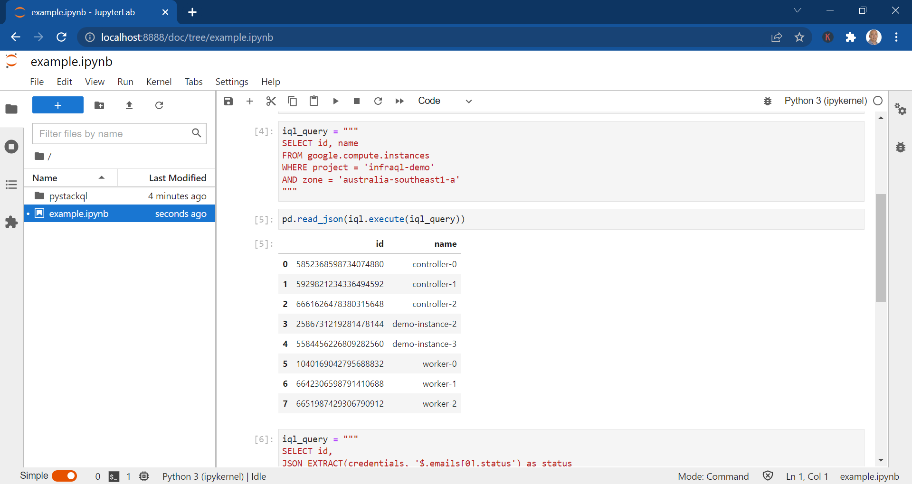

# StackQL Jupyter Demo

Query cloud inventory and perform analysis and visualisations using Jupyter, Python and StackQL.

## Prerequisites

- Docker
- Doocker Compose (optional)

## Instructions run from Dockerhub


## Instructions to build and run locally

1. Clone this repo `git clone https://github.com/stackql/stackql-jupyter-demo`
2. Add credentials for the providers required by... 
- adding the appropriate service account key(s) to the `keys/` directory 
- adding the appropriate API key(s) as `KEYNAME=keyval` to a file in your root directory named `apikeys.env`
3. Build the image:
```shell
docker build --no-cache -t stackql-jupyter-demo .
```
4. Run the image:
```shell
docker run -dp 8888:8888 --env-file ./apikeys.env stackql-jupyter-demo start-notebook.sh --NotebookApp.token=''
```
> Add authentication if running this on a server which is accessible to others, see https://jupyter-notebook.readthedocs.io/en/stable/security.html
5. Run your StackQL commands!
6. Stop your running container when finished:
```shell
docker stop $(docker ps -l -q --filter status=running --filter ancestor=stackql-jupyter-demo)
```


```
docker compose up --build
# docker compose down
# docker rmi stackql-jupyter-demo-jupyter:latest
```
docker cp /hostfile  (container_id):/(to_the_place_you_want_the_file_to_be)

## Example

